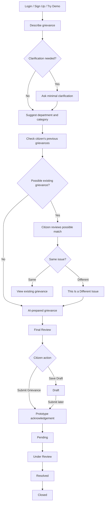
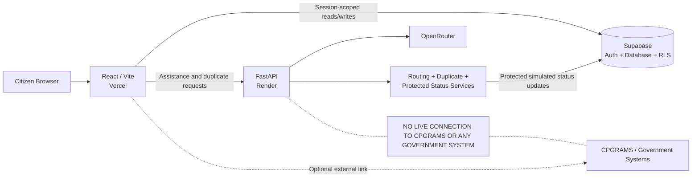

# Smart CPGRAM Assistant

AI-assisted grievance preparation, routing, duplicate awareness, prototype submission, and lifecycle tracking—starting with the citizen’s own words.

> **Independent hackathon prototype. Not affiliated with CPGRAMS or the Government of India. No grievance is transmitted to a Government of India system.**

## Problem

Citizens know what happened, but may not know the right department or category. Informal descriptions can be unclear, important facts may be missing, repeat grievances may be raised unnecessarily, and the service lifecycle may be unfamiliar. Traditional forms ask citizens to understand administrative structure before they can explain their problem.

## Solution

**Tell us what happened → AI understands → asks minimal clarification → suggests routing → checks previous grievances → prepares a formal grievance → citizen reviews → simulated Submit → acknowledgement → status lifecycle.**

The citizen completes this prototype journey without leaving the application. The official CPGRAMS website is an optional secondary link only.

## Why This Is Different

| Traditional approach | Smart CPGRAM Assistant |
| --- | --- |
| Citizen must understand **Department → Category → Form → Description** | Citizen begins with **“Tell us what happened.”** |
| Taxonomy comes before the citizen’s story | Natural language maps to a controlled prototype taxonomy |
| Repeat complaints may be hard to notice | The citizen’s own history is checked for a possible related issue |

## User Journey Diagram



## Architecture Diagram



The service-role credential is used only by the protected Render endpoint. It is never shipped to the browser or Vercel.

## Real vs Simulated

| Real in this prototype | Simulated |
| --- | --- |
| Supabase authentication, session restore, and RLS | Government submission and official acknowledgement |
| OpenRouter AI assistance and guardrails | Department processing and government status updates |
| Controlled routing and duplicate checking | CPGRAMS integration |
| Draft and prototype submission storage | Any Government of India backend interaction |
| Authenticated history and synthetic demo history | |
| Protected forward-only status API | |

## Possible Duplicate ≠ Duplicate

Semantic similarity is advisory. The interface says **“Possible existing grievance”** because similar language may describe a different date, location, transaction, or event. The citizen retains control through **“This Is a Different Issue”** and can continue preparing the new grievance.

## Status Lifecycle


Citizen submission creates `Pending` or upgrades the same saved `Draft` row. Processing after Pending is simulated. Citizen-facing code cannot advance processing statuses; forward transitions use a protected backend API and database enforcement.

## Demo Mode

Demo Mode needs no registration. It uses privacy-safe synthetic history, is isolated from authenticated users and Supabase writes, and keeps a simulated submission only in the current browser session. References use `SMART-DEMO-{YEAR}-{8 chars}` and the UI labels Demo Mode, Synthetic Data, and Simulated Submission—making it suitable for judges without real citizen data.

## Privacy & Security

- Supabase RLS remains the primary per-user data boundary.
- Storage functions derive `user_id` from the current Supabase session; UI callers cannot supply it.
- A database trigger prevents citizens from changing grievance identity or advancing processing status.
- OpenRouter, demo-admin, and Supabase service-role keys are backend-only.
- Authenticated duplicate candidates come only from RLS-filtered session history; demo data stays synthetic.
- Complaint length, controlled categories, statuses, references, model output, and admin payloads are validated.
- Sensitive clarification prompts for Aadhaar, PAN, OTPs, passwords, and financial credentials are filtered.
- CORS uses an explicit allowlist; wildcard origins are discarded.
- The admin key is constant-time compared, never logged or returned, and status writes are race-safe.
- There is no live government API, scraping, automated official form submission, or government credential handling.

## AI Guardrails

The AI may organize only citizen-supplied facts. It must not invent dates, locations, amounts, reference numbers, laws or policies, or government actions. It asks at most two necessary clarification questions and avoids sensitive identifiers and credentials.

## Technology Stack

| Layer | Technology |
| --- | --- |
| Frontend | React, Vite, Tailwind CSS |
| Backend | FastAPI, Python |
| Auth / database | Supabase |
| Runtime AI | OpenRouter |
| Deployment | Vercel + Render |
| Development | OpenAI Codex |

## Built with Codex

Codex was meaningfully used for architecture and security review, Supabase integration, the grievance journey, duplicate detection, submission lifecycle, protected status API, tests, deployment guidance, and documentation. Runtime AI remains OpenRouter; this project does not claim OpenAI as its runtime model provider.

## Repository Structure

```text
smart-cpgram-assistant/
├── backend/
│   ├── data/grievances.json
│   ├── tests/test_api.py
│   ├── .env.example
│   ├── main.py
│   ├── requirements.txt
│   └── requirements-dev.txt
├── docs/hackathon.md
├── frontend/
│   ├── public/
│   ├── src/
│   │   ├── components/auth/AuthPage.jsx
│   │   ├── lib/supabase.js
│   │   ├── services/
│   │   ├── App.jsx
│   │   ├── index.css
│   │   └── main.jsx
│   ├── .env.example
│   ├── package.json
│   └── vite.config.js
├── supabase/migrations/202608240001_release_lifecycle.sql
└── README.md
```

Generated output, dependencies, caches, and local `.env` files are omitted.

## Local Setup

Prerequisites: Node.js supported by Vite 8 and Python 3.12+.

Backend (Windows PowerShell):

```powershell
cd backend
python -m venv .venv
.\.venv\Scripts\Activate.ps1
python -m pip install -r requirements-dev.txt
Copy-Item .env.example .env
uvicorn main:app --reload
```

Frontend, in a second window:

```powershell
cd frontend
npm.cmd ci
Copy-Item .env.example .env
npm.cmd run dev
```

Apply `supabase/migrations/202608240001_release_lifecycle.sql` through Supabase SQL Editor or CLI. Keep RLS enabled and verify policies restrict rows with `auth.uid() = user_id`.

## Environment Variables

Frontend (`frontend/.env`, Vercel only):

```text
VITE_SUPABASE_URL
VITE_SUPABASE_PUBLISHABLE_KEY
VITE_API_BASE_URL
```

Backend (`backend/.env`, Render only):

```text
OPENROUTER_API_KEY
OPENROUTER_MODEL
ALLOWED_ORIGINS
DEMO_ADMIN_API_KEY
SUPABASE_URL
SUPABASE_SERVICE_ROLE_KEY
```

The service-role key is required because the protected status endpoint must update processing status while citizen policies forbid it. Never use backend secrets in `VITE_*`, Vercel, browser code, source control, logs, or responses.

## API Overview

| Method | Route | Purpose | Auth requirement |
| --- | --- | --- | --- |
| GET | `/` | Service metadata | None |
| GET | `/api/health` | Health check | None |
| POST | `/api/v1/grievance-assistance` | Routing, clarification, prepared grievance | None; rate limited |
| POST | `/api/v1/duplicate-check` | Compare RLS-scoped authenticated history | Candidates originate from session history |
| PATCH | `/api/v1/admin/grievances/{grievance_id}/status` | Forward-only simulated transition | `X-Demo-Admin-Key`; server-side service role |
| GET | `/api/users/{user_id}/grievances` | Synthetic `DEMO035` history | None |
| POST | `/api/check-duplicate` | Synthetic demo duplicate check | `DEMO035` only |
| POST | `/api/classify` | Compatibility classification route | None; rate limited |
| POST | `/api/rewrite` | Compatibility preparation route | None; rate limited |

## Deployment

### Frontend → Vercel

- Root: `frontend`; install: `npm ci`; build: `npm run build`; output: `dist`.
- Configure only the three frontend variables.
- Set `VITE_API_BASE_URL` to the HTTPS Render origin and redeploy after changes.

### Backend → Render

- Root: `backend`; build: `pip install -r requirements.txt`.
- Start: `uvicorn main:app --host 0.0.0.0 --port $PORT`.
- Configure all six backend variables and health path `/api/health`.
- Set `ALLOWED_ORIGINS` to exact Vercel/local origins, comma-separated and without paths.

### Auth / database → Supabase

- Apply the release migration, preserve RLS and per-user policies, configure Vercel Auth URLs, and keep the service-role key only in Render.

## Testing

Final local commands and results on 24 August 2026:

```powershell
cd frontend
npm.cmd run lint
npm.cmd run build
cd ..\backend
.\.venv\Scripts\python.exe -m pytest -q
python -m py_compile main.py
python -c "import main; print(main.app.title, main.app.version, len(main.app.routes))"
```

ESLint passed. Vite production build passed (65 modules). Pytest passed **15/15** tests. Backend compile/import passed with **13 registered FastAPI routes**. One non-functional pytest cache-write warning came from the restricted test sandbox.

Coverage includes input/provider validation, duplicate checks, clarification filtering, demo data, missing/wrong admin keys, invalid status/reference, unknown grievance, all forward transitions, backward rejection, `user_id` rejection, and simulated/timestamp responses. Auth persistence and RLS behavior require a deployed Supabase smoke test.

## Synthetic Data

The raw citizen grievance dataset is not deployed. `backend/data/grievances.json` contains privacy-safe synthetic data for demo/evaluation and no intentional real citizen PII. Demo submission state is never written to Supabase.

## Current Limitations

- No live CPGRAMS integration; government processing is simulated.
- The 35-category taxonomy is not the complete CPGRAMS taxonomy.
- Duplicate detection is advisory.
- Free AI/backend hosting may introduce cold starts, quotas, and availability limits.
- Rate protection is in-memory per backend instance, not distributed.
- This is not production government software.

## Path to Production

- Obtain an approved sandbox/API and complete official taxonomy.
- Complete security, privacy, retention, and independent accessibility reviews.
- Add tamper-evident audit logging and formal operator authorization.
- Add evaluated multilingual support.
- Add distributed rate limiting, abuse controls, monitoring, and incident response.

## Screenshots

Add real screenshots before judging; do not substitute fabricated images.

- Landing — _screenshot pending_
- Try Demo — _screenshot pending_
- AI Assistance — _screenshot pending_
- Possible Existing Grievance — _screenshot pending_
- Final Review — _screenshot pending_
- Submission Confirmation — _screenshot pending_
- History / Status — _screenshot pending_

## Release Honesty

Authentication, assistance, routing, duplicate awareness, drafts, stored prototype submissions, history, and protected transitions work when configured. Government submission, acknowledgement, processing, and integration remain clearly simulated.
